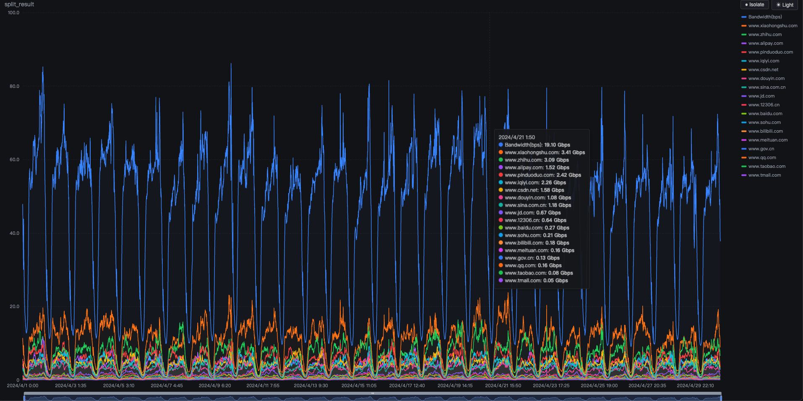
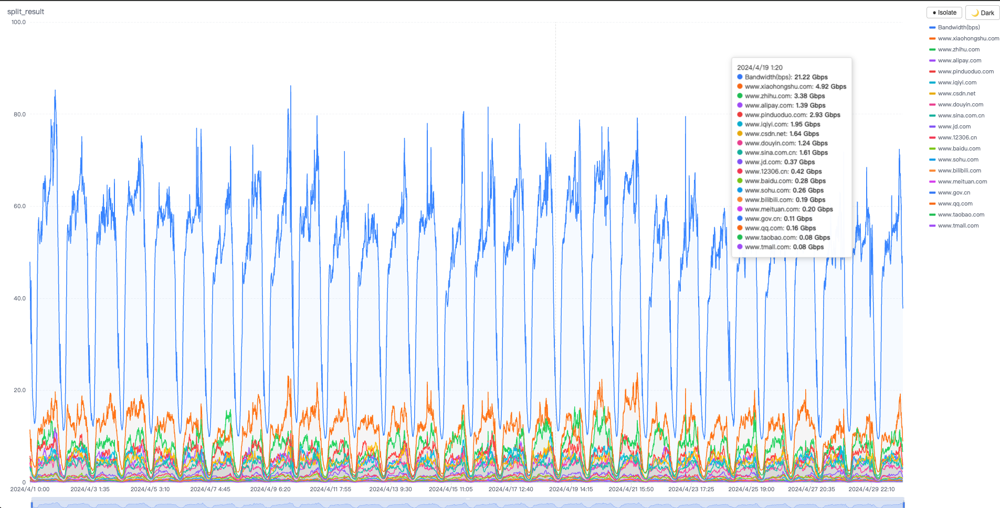

# csvtochart

将带宽 CSV 数据转换为 Grafana 风格的离线交互式 HTML 图表。

Convert bandwidth CSV data into a Grafana-style offline interactive HTML chart.

## Screenshot / 效果展示

> 打开 `examples/bandwidth_chart.html` 即可在浏览器中查看完整交互效果。




**图表特性 / Chart Features:**
- 🌗 深色/浅色主题切换 (Dark/Light theme toggle)
- 🔍 Isolate 模式：单击图例多选独显 (Click legend to multi-select & isolate)
- 🚫 Hide 模式：单击图例隐藏指定线 (Click legend to hide lines)
- 📊 时间轴缩放 (Time-axis zoom with slider & mouse wheel)
- 📐 Y 轴自动换算单位 (Auto unit: bps → Kbps → Mbps → Gbps → Tbps, 1000-based)
- 📡 完全离线，无需网络 (Fully offline, no network needed)

## Install / 安装

### Download Binary / 下载可执行文件

从 [Releases](https://github.com/stanhui/csvtochart/releases) 下载对应平台的可执行文件：

| Platform | File |
|----------|------|
| Linux x86_64 | `csvtochart_linux_amd64` |
| Linux ARM64 | `csvtochart_linux_arm64` |
| macOS Intel | `csvtochart_darwin_amd64` |
| macOS Apple Silicon | `csvtochart_darwin_arm64` |
| Windows x86_64 | `csvtochart_windows_amd64.exe` |

### Build from Source / 从源码编译

```bash
go install github.com/stanhui/csvtochart@latest
```

Or:

```bash
git clone https://github.com/stanhui/csvtochart.git
cd csvtochart
go build -o csvtochart .
```

## Usage / 用法

```bash
csvtochart [flags] <input.csv> [output.html]
```

### Examples / 示例

```bash
# 默认 bps 单位，输出同名 .html
csvtochart bandwidth.csv

# 指定 CSV 数据单位为 Mbps
csvtochart -unit Mbps bandwidth.csv

# 指定输出路径和标题
csvtochart -unit Gbps -title "CDN Bandwidth" data.csv report.html
```

### Flags / 参数

| Flag | Default | Description |
|------|---------|-------------|
| `-unit` | `bps` | CSV 中带宽数据的单位 / Unit of values in CSV: `bps`, `Kbps`, `Mbps`, `Gbps`, `Tbps` |
| `-title` | 文件名 | 图表标题 / Chart title |

### Input CSV Format / 输入格式

第一列为时间戳，其余列为带宽数值，列名即为图表中的系列名称：

Column 0 = timestamps, remaining columns = bandwidth values. Column names become series names.

```csv
,domain1.com,domain2.com,domain3.com
2025-01-01 00:00:00,100.5,200.3,150.8
2025-01-01 00:05:00,110.2,190.1,160.5
```

### Unit Conversion / 单位换算

Y 轴和 Tooltip 使用 **1000 进制**（网络带宽标准）：

| Unit | = bps |
|------|-------|
| 1 Kbps | 1,000 bps |
| 1 Mbps | 1,000,000 bps |
| 1 Gbps | 1,000,000,000 bps |
| 1 Tbps | 1,000,000,000,000 bps |

## Release / 发布

打 tag 后 GitHub Actions 自动编译并发布所有平台的可执行文件：

```bash
git tag v1.0.0
git push origin v1.0.0
```

## License

MIT
